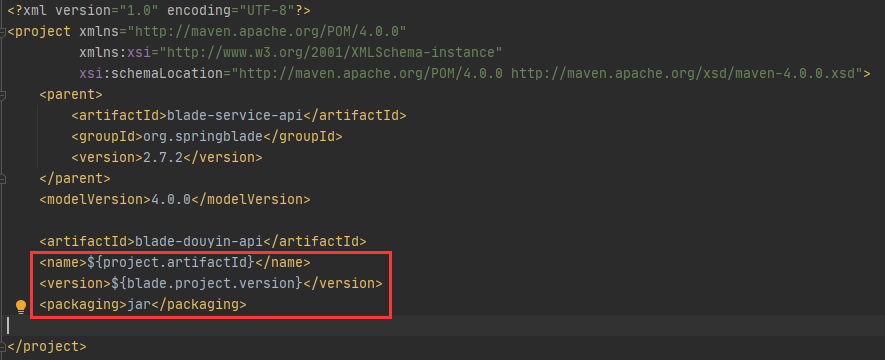
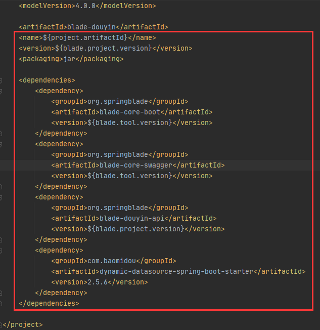
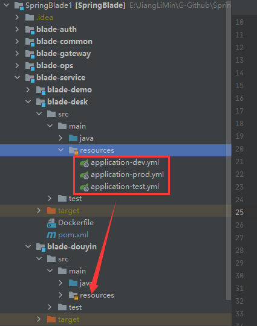
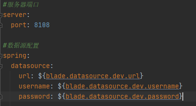
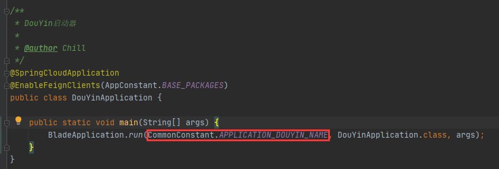

# BenTengYinLiu

## 1. 后端部分

### 1.1 blade 框架模块结构及开发介绍
```
Springblade
├── blade-auth -- 授权服务提供
├── blade-common -- 常用工具封装包
├── blade-gateway -- Spring Cloud 网关
├── blade-ops -- 运维中心
├ ├── blade-admin -- spring-cloud后台管理
├ └── blade-develop -- 代码生成
├── blade-service -- 业务模块
├ ├── blade-desk -- 工作台模
├ ├── blade-log -- 日志模块
├ ├── blade-system -- 系统模块
├ └── blade-user -- 用户模块
├── blade-service-api -- 业务模块api封装
├ ├── blade-desk-api -- 工作台api
├ ├── blade-dict-api -- 字典api
├ ├── blade-system-api -- 系统api
└ └── blade-user-api -- 用户api
```
日常开发中，我们用的最多的模块则是 `blade-service` 以及 `blade-service-api`

### 1.2 创建子工程
1.2.1 在 `blade-service` 上右击依次选则 `New -> Module`

1.2.2 在 `New Module` 界面选中左侧的 `Maven` 并且点击 `Next`

1.2.3 设置 `ArtifactId` 和 `Module name` 子工程名称 本项目为抖音项目，所以设置为 `blade-douyin`

1.2.4 以同样方法在 `blade-service-api` 下新建 `blade-douyin-api` 工程

### 1.3 修改工程版本依赖

1.3.1 打开 `blade-douyin-api` 工程下的 `pom.xml` 设置基本信息



1.3.2 打开 `blade-douyin` 工程下的 `pom.xml` 设置基本信息



### 1.4 工程配置
1.4.1 参考 `blade-desk` 模块，将 `resources` 下的文件拷贝到 `blade-douyin` 的 `resources` 文件夹下



1.4.2 修改下 application-dev.yml 下 server.port 的值为8108(可以定义为其他端口，但必须不冲突)



1.4.3 在 blade-douyin 的 java 包下新建 package 命名为 `org.springblade.douyin`

1.4.4 参考 `blade-desk` 模块，将 `DeskApplication` 拷贝至刚新建的包下并重命名为 `DouYinApplication`

1.4.5 打开 `blade-common -> src -> main -> java -> org.springblade.common -> constant -> CommonConstant` 新增一个通用变量拼接出子工程名

```
String APPLICATION_DOUYIN_NAME = AppConstant.APPLICATION_NAME_PREFIX + "douyin";
```

1.4.6 修改 `DouYinApplication`



1.4.7 右击 DemoApplication 启动，查看服务是否注册到了 Nacos

1.4.8 我们先启动Demo服务，并访问 http://localhost:8848/nacos 查看效果

1.4.9 如果我们看到blade-demo在注册列表中，说明一个新的微服务已经诞生！

### 1.5 创建API
1.5.1 为了保证工程结构清晰，我们将不同用处的类归并到对应功能描述的 `package` 中。

1.5.2 在 `blade-douyin -> org.springblade` 中 创建 `controller` 的 `package` 并创建一个 `DouYinController` 的类

1.5.3 在 `blade-douyin-api -> src -> main -> java` 下 创建 `org.springblade.douyin` 在创建实体类 `DspAweme`、`DspUser`

### 1.6 创建实体类
1.6.1 在 `DspAweme` 中增加如下字段
`DspUser` 相同
```
@Data
@TableName("dsp_aweme") // 表名
public class DspAweme implements Serializable {
	private static final long serialVersionUID = 1L;

	/**
	 * 主键
	 */
	@TableId(value = "id", type = IdType.AUTO) // id 自增
	private Integer id;

	/**
	 * 视频id
	 */
	private String awemeId;

	/**
	 * 视频名称
	 */
	private String awemeDesc;

	/**
	 * 视频类型
	 */
	private String awemeType;

	/**
	 * 视频时长
	 */
	private String awemeDuration;

	/**
	 * 视频发布者id
	 */
	private String awemeAuthorUserId;

	/**
	 * 视频发布者id
	 */
	private String awemeAuthorUid;

	/**
	 * 视频发布者抖音号
	 */
	private String awemeAuthorUniqueId;

	/**
	 * 视频发布者名称
	 */
	private String awemeAuthorNickname;

	/**
	 * 视频发布者签名
	 */
	private String awemeAuthorSignature;

	/**
	 *
	 */
	private String awemeAuthorShortId;

	/**
	 * 视频发布者头像 100*100
	 */
	private String awemeAuthorAvatarThumb;

	/**
	 * 视频发布者头像 720*720
	 */
	private String awemeAuthorAvatarMedium;

	/**
	 * 视频发布者头像 1080*1080
	 */
	private String awemeAuthorLarger;

	/**
	 * 音乐名称
	 */
	private String awemeMusicTitle;

	/**
	 * 音乐发布者
	 */
	private String awemeMusicAuthor;

	/**
	 * 音乐地址
	 */
	private String awemeMusicUrl;

	/**
	 * 音乐id
	 */
	private String awemeMusicId;

	/**
	 *
	 */
	private String awemeMusicMid;

	/**
	 * 音乐时长
	 */
	private String awemeMusicDuration;

	/**
	 * 音乐发布者头像 100*100
	 */
	private String awemeMusicCoverThumb;

	/**
	 * 音乐发布者头像 1080*1080
	 */
	private String awemeMusicCoverLarge;

	/**
	 * 音乐发布者头像 720*720
	 */
	private String awemeMusicCoverMedium;

	/**
	 * 音乐发布者头像 1080*1080
	 */
	private String awemeMusicCoverHd;

	/**
	 * 音乐状态
	 */
	private String awemeMusicStatus;

	/**
	 * 视频时长
	 */
	private String awemeVideoDuration;

	/**
	 * 视频 有码
	 */
	private String awemeVideoPayAddrUrl;

	/**
	 * 视频图片
	 */
	private String awemeVideoCover;

	/**
	 * 视频动态图片
	 */
	private String awemeVideoDynamicCover;

	/**
	 * 视频图片原图
	 */
	private String awemeVideoOriginCover;

	/**
	 *
	 */
	private String awemeVideoVid;

	/**
	 * 视频分享地址
	 */
	private String awemeVideUrl;

	/**
	 * 视频评论数
	 */
	private Integer awemeStatisticsCommentCount;

	/**
	 * 视频点赞数
	 */
	private Integer awemeStatisticsDiggCount;

	/**
	 * 视频发布时间
	 */
	private String awemeCreateTime;

	private Integer con;
}
```

### 1.7 创建Service和Mapper
1.7.1 在 `blade-douyin` 中创建 `service` 和 `mapper` 两个 `package`

1.7.2 在 `service` 下 创建 `DspAwemeService` 的接口类

1.7.3 在 `service` 下 创建 `impl` `package` 并且在 `impl` 中创建 `DspAwemeServiceImpl` 接口实现类

1.7.4 在 `mapper` 下 创建 `DspAwemeMapper` 和 `DspAwemeMapper.xml`

1.7.6 在 `DspAwemeMapper.xml` 中添加如下内容，通过查询映射结果，则做到了实体类与数据库字段对应的关系

1.7.7 注意 `DspAwemeMapper.xml` 的 `namespace` 和 `resultMap` 的 `type` 要指向正确的地址

1.7.8 `namespace` 指向对应的 `DspAwemeMapper.java` 接口类， `type` 指向对应的 `DspAweme.java` 实体类

### 1.8 增加配置
1.8.1 `DspAwemeMapper` 增加 `mybatis-plus` 的配置

```
package org.springblade.douyin.mapper;

import com.baomidou.mybatisplus.core.mapper.BaseMapper;
import org.springblade.douyin.entity.DspAweme;

import java.util.List;

public interface DspAwemeMapper extends BaseMapper<DspAweme> {

}

```

1.8.2 `DspAwemeService` 增加 `mybatis-plus` 的配置

```
package org.springblade.douyin.service;

import com.baomidou.mybatisplus.extension.service.IService;
import org.springblade.douyin.entity.DspAweme;

public interface DspAwemeService extends IService<DspAweme> {
}
```

1.8.3 `DspAwemeServiceImpl` 增加 `mybatis-plus` 的配置

```
package org.springblade.douyin.service.impl;

import com.baomidou.mybatisplus.extension.service.impl.ServiceImpl;
import org.springblade.douyin.entity.DspAweme;
import org.springblade.douyin.mapper.DspAwemeMapper;
import org.springblade.douyin.service.DspAwemeService;
import org.springframework.stereotype.Service;

@Service
public class DspAwemeServiceImpl extends ServiceImpl<DspAwemeMapper, DspAweme> implements DspAwemeService {
}
```

1.8.4 注意：SpringBlade默认的mybatis扫描包名为 org.springblade ，不在此目录下的bean无法被mybatis扫描到，新的服务肯定会使用其他的包名，这种情况需要自己额外定义一个配置类，配置包扫描的路径，以及mybatis-plus扫描bean-alias的配置。

1.8.5 在 `org.springblade.douyin` 下创建 `config` `package` 在创建一个 `DouYinConfiguration` 内容如下
```
package org.springblade.douyin.config;

import org.mybatis.spring.annotation.MapperScan;
import org.springframework.cloud.openfeign.EnableFeignClients;
import org.springframework.context.annotation.Configuration;

@Configuration
@EnableFeignClients({"org.springblade"})
@MapperScan({"org.springblade.**.mapper.**", "com.example.**.mapper.**"})
public class DouYinConfiguration {
}
```

1.8.6 在 `blade-douyin` 下的 `resources` 中创建 `application.yml` 内容如下

```
#mybatis-plus配置
mybatis-plus:
  mapper-locations: classpath:com/example/**/mapper/*Mapper.xml
  #实体扫描，多个package用逗号或者分号分隔
  typeAliasesPackage: com.example.**.entity

#swagger扫描路径配置
swagger:
  base-packages:
    - org.springbalde
    - com.example
```

### 1.9 增加API

1.9.1 在 `DspAwemeMapper` 中 创建接口
```
List<DspAweme> dspAwemeList(String name);
```

1.9.2 在 `DspAwemeMapper.xml` 中 增加 查询接口Sql
```
<select id="dspAwemeList" resultMap="dspAwemeResultMap">
    select aweme_desc,FROM_UNIXTIME(aweme_create_time, '%Y-%m-%d %H:%i:%s') aweme_create_time,aweme_author_nickname,aweme_statistics_digg_count,aweme_statistics_comment_count from dsp_aweme where id in (select id from dsp_aweme where aweme_desc like concat('%', #{name}, '%'))  limit 100
</select>
```

1.9.3 在 `DouYinController` 增加接口
```
// 创建Service 实例
private DspAwemeService dspAwemeService;
// 创建Mapper 实例
private DspAwemeMapper dspAwemeMapper;

// 创建接口
@GetMapping("home/aweme/list")
public R<List<DspAweme>> homeAwemeList(){
    return R.data(dspAwemeMapper.homeDspAwemeList());
}
```

## 2. 前端部分
### 2.1 前端主要使用element ui实现

### 2.2 如果修改了 后台接口服务端口 则修改 `vue.config.js` 中的 `target`

### 2.3 实现接口
2.3.1 在 `src -> api` 下创建 `douyin` 文件夹 并且增加 `home.js` 文件

2.3.2 增加调用后台接口方法 内容如下
```javascript
import request from '@/router/axios';

export const getAwemeList = () => {
  return request({
    url: '/api/blade-douyin/douyin/home/aweme/list',
    method: 'get',
  })
}
```
2.3.3 Vue 调用接口 在 script标签中 增加如下内容
```javascript
import {getAwemeList} from '@/api/douyin/home'

export default {
  name: "index",
  components: {},
  data() {
    return {
        awemeData: []
    }
  },
  created() {
    this.awemeList();
  },
  methods: {
    awemeList() {
      getAwemeList().then(res => {
        this.awemeData = res.data.data;

        for (let i = 0; i < this.awemeData.length; i++) {
          if (this.awemeData[i].awemeStatisticsCommentCount > 10000) {
            this.awemeData[i].awemeStatisticsCommentCount = (this.awemeData[i].awemeStatisticsCommentCount / 10000).toFixed(2) + "W"
          }
          if (this.awemeData[i].awemeStatisticsDiggCount > 10000) {
            this.awemeData[i].awemeStatisticsDiggCount = (this.awemeData[i].awemeStatisticsDiggCount / 10000).toFixed(2) + "W"
          }
          if (this.awemeData[i].awemeDesc.length > 7) {
            this.awemeData[i].awemeDesc = this.awemeData[i].awemeDesc.substring(0, 7) + "..."
          }
        }
      });
    }
  }
}
```

2.3.4 具体页面实现参考element ui
